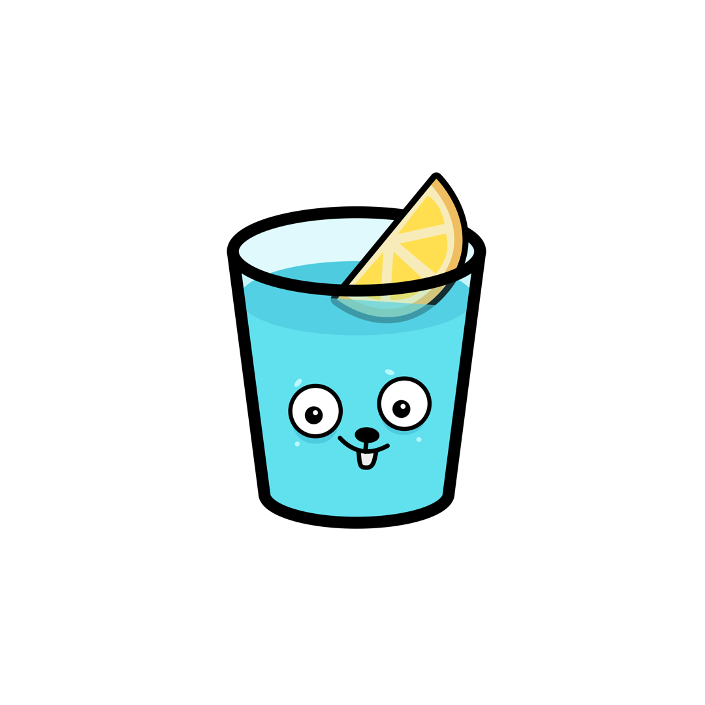

<br>
<div align="center">
    <div >
        
    </div>
    <div>
            <h3><b>Glutara</b></h3>
            <p><i>A Key to Your Diabetes Journey</i></p>
    </div>      
</div>
<br>
<h1 align="center">Glutara Backend</h1>
The silent maestro: Glutara's robust backend hums quietly behind the scenes, orchestrating the flow of data, ensuring seamless performance and secure storage. It's the invisible force making everything tick, keeping your health journey smooth and reliable.

## 👨🏻‍💻 &nbsp;Technology Stack

<div align="center">
<kbd>

</kbd>
<kbd>

</kbd>
<kbd>

</kbd>
<kbd>

</kbd>
</div>
<div align="center">
<h4>Firebase | Go | Gin | Google Maps Platform</h4>
</div>

## Getting Started
Make sure you already do these things before running the code
1. Install Go language on your computer

## ⚙️ &nbsp;How to Run
1. Clone this repository from terminal using this following command
    ``` bash
    git clone https://github.com/Glutara/glutara-backend.git
    ```
2. Create a .env file inside the repository directory using .env.example file as the template. You can keep the variables blank. The server should automatically use port 8080 as the default port and port 8605 as the model serving port
3. Run the server using this following command
    ``` bash
    go run main.go
    ```
4. Glutara backend server should be running. You can also check the server by opening http://localhost:8080/api
5. You could also check our deployed backend server by opening https://glutara-rest-api-reyoeq7kea-uc.a.run.app/api
    
## 🔑 &nbsp;List of Endpoints

| Endpoint                             |  Method  |   Usage  |
| ------------------------------------ | :------: | -------- |
| /api/auth/register                   | POST     | Users can register and create account on Glutara App
| /api/auth/login                      | POST     | Users can log in to their previously created account
| /api/{UserID}/reminders              | GET      | Users can see their reminders
| /api/{UserID}/reminders              | POST     | Users can add a new reminder
| /api/{UserID}/reminders/{ReminderID} | DELETE   | Users can delete existing reminder
| /api/{UserID}/reminders/{ReminderID} | PUT      | Users can update existing reminder
| /api/{UserID}/sleeps                 | GET      | Users can see their sleep logs
| /api/{UserID}/sleeps                 | POST     | Users can add a new sleep log
| /api/{UserID}/sleeps/{SleepID}       | DELETE   | Users can delete existing sleep log
| /api/{UserID}/sleeps/{SleepID}       | PUT      | Users can update existing sleep log
| /api/{UserID}/exercises              | GET      | Users can see their exercise logs
| /api/{UserID}/exercises              | POST     | Users can add a new exercise log
| /api/{UserID}/exercises/{ExerciseID} | DELETE   | Users can delete existing exercise log
| /api/{UserID}/exercises/{ExerciseID} | PUT      | Users can update existing exercise log
| /api/{UserID}/meals                  | GET      | Users can see their meal logs
| /api/{UserID}/meals                  | POST     | Users can add a new meal log
| /api/{UserID}/meals/{MealID}         | DELETE   | Users can delete existing meal log
| /api/{UserID}/meals/{MealID}         | PUT      | Users can update existing meal log
| /api/{UserID}/medications                  | GET      | Users can see their medication logs
| /api/{UserID}/medications                  | POST     | Users can add a new medication log
| /api/{UserID}/medications/{MedicationID}   | DELETE   | Users can delete existing medication log
| /api/{UserID}/medications/{MedicationID}   | PUT      | Users can update existing medication log
| /api/{UserID}/glucoses/info/graphic        | GET      | Users can see graphic of their blood glucose level fluctuation at a certain day
| /api/{UserID}/glucoses/info/average        | GET      | Users can see the average value of their blood glucose level as of today, this week, and this month
| /api/{UserID}/glucoses               | POST     | System can automatically predict and save user's blood glucose level
| /api/{UserID}/logs                   | GET     | Users can view a comprehensive list of all their log activity
| /api/{UserID}/relations              | GET     | Users with 'patient' role can see info and location of another user that is related to them
| /api/{UserID}/relations              | POST    | Users with 'patient' role can add new user as their relative
| /api/{UserID}/relations/related      | GET     | Users with 'relation' role can see info and current blood glucose level of another user with 'patient' role
| /api/{UserID}/scan                   | POST    | Users can post picture of their food to know the name and nutritional value of that food

## 👥 &nbsp;Contributors

| <a href="https://github.com/mikeleo03"></a> | <a href="https://github.com/GoDillonAudris512"></a> | <a href="https://github.com/margarethaolivia"></a> | <a href="https://github.com/AustinPardosi"></a> |
| ---------------------------------------------------------------------------------------------------------------------------------------------------------------------------------------------------------------------------------- | ----------------------------------------------------------------------------------------------------------------------------------------------------------------------------------------------------------------------------------- | -------------------------------------------------------------------------------------------------------------------------------------------------------------------------------------------------------------------------- | ----------------------------------------------------------------------------------------------------------------------------------------------------------------------------------------------------------------------------- |
| <div align="center"><h3><b><a href="https://github.com/mikeleo03">Michael Leon Putra Widhi</a></b></h3><p>Hustler</p><p><i>Bandung Institute of Technology</i></p></div>                                                                               | <div align="center"><h3><b><a href="https://github.com/GoDillonAudris512">Go Dillon Audris</a></b></h3></a><p>Hacker</p><p><i>Bandung Institute of Technology</i></p></div>                                                                          | <div align="center"><h3><b><a href="https://github.com/margarethaolivia">Margaretha Olivia Haryono</a></b></h3></a><p>Hipster</p><p><i>Bandung Institute of Technology</i></p></div></a>                                                               | <div align="center"><h3><b><a href="https://github.com/AustinPardosi">Austin Gabriel Pardosi</a></b></h3></a><p>Hacker</p><p><i>Bandung Institute of Technology</i></p></div>                                                                            |
